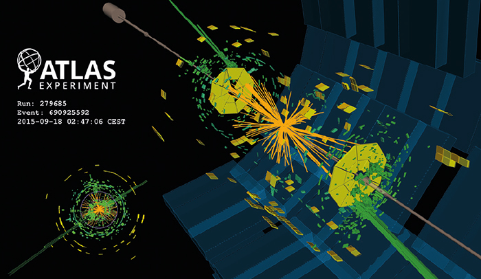
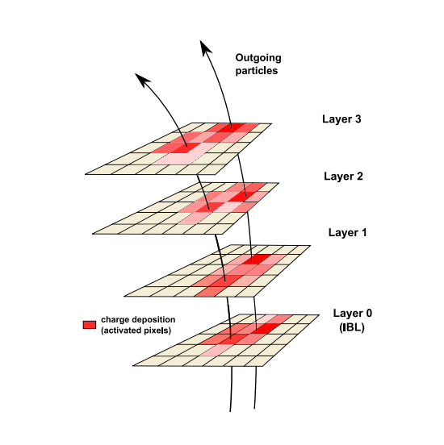

# Pixel Number Network: Classify Particle Multiplicity

This work is part of the [ATLAS experiment](https://atlas.cern/) at [CERN](https://home.cern/).
With the unmanageable size of data coming from within the detector during a run of the [Large Hadron Collider](https://home.cern/science/accelerators/large-hadron-collider), it is imperative to determine which data to keep. The trigger system for the ATLAS detector, particularly the ambiguity solver, uses many deep learning networks and conventional algorithms to determine what data is important; this neural network is a small part of the ambiguity solver and it is used to classify the number of particles passing through a given cluster of pixel sensors in the pixel detector of ATLAS.


### Data Inputs
* 7x7 discretized matrix of charges obtained from the calibration of time-over-threshold values measured by the pixel sensors and centered on the charge centroid. The charge matrix is flattened into a length 49 vector in row-major order. 
* 7 length vector of pixel pitches in the local Y direction as the pixel size is not constant in this direction. The positions are measured in a frame of reference local to the pixel sensor considered, in which the local X and Y directions correspond to the transverse and longitudinal directions respectively.
* 0 or 2 or -2 encoding the pixel detector region (barrel, end cap, or back endcap).
* 0,1,2, or 3 representing the cylinder (barrel) or disk (endcap) layer. There are three end cap layers for each side and four barrel layers. The 1st barrel layer is the insertable b-layer and has a different construction with finer resolution than the rest of the barrel.
* φ and θ angles of incidence for the charged particle going through the cluster.


Total of 60 input features (49 + 7 + 1 + 1 + 2) per cluster.


The output vector for inference on one cluster is of the shape (1, 3) of probabilities in the following format:


* [1 particle probability, 2 particles probability, 3+ particles probability]


### Usage
Step 1: Analysis Object Data (AOD) is stored in root file(s) 'naturalsplit.root' (optional: split AOD into 'ibl.root', 'barrel.root', 'endcap.root') and transformed into hierarchical data format (hdf5) using the following command:

```
python scripts/toh5.py --input data/naturalsplit.root --output data/naturalsplit.h5 --nclusters 15000000 --type number
```

Step 2: ```	Split Dataset.ipynb ``` notebook contains utilities like the ability to visualize distribution of labels among the several layers of the pixel detector (under "Exploring Data Structure"). It also creates the training and testing samples, and can draw random samples from the generated .h5 data files and append them all to one file. If the AOD was split this notebook could create a training sample from an equal number of randomly sampled clusters from the three layer files, each with an equal amount of labels (particle multiplicity) per cluster. 

Step 3: Train the network to classify the number of particles per cluster.

```
python scripts/run_training.py --input data/train.h5 --model share/reference_number.py --name models/numbernetwork_model.h5
``` 

Step 4: Apply the network to testing data. Outputs layer values, predicted labels and true labels into an hdf5 file. The directory may be specified by --output (default is base directory) and/or the location and name of the file can be specified by --name (default is the name of the model with '_applied.h5' appended).

```
python scripts/apply.py --input data/test.h5 --type number --model models/numbernetwork_model.h5 --output output/
```

Step 5: Plot the receiver operating characteristic curves (ROC curve) of the neural network overall and on each layer. ```plot_rocs.py``` has the parameter --input for the directory of the files generated by apply.py from the previous step, which we will call the applied model files. ```plot_rocs.py``` also has mutually exclusive parameters --model which accepts one applied model file, or --models for  a list of multiple applied model files. The same for the --label/--labels parameters. The parameter --output indicates the directory where the folder of the model's roc curves will be generated.

```
python scripts/plot_rocs.py --input output/  --model numbernetwork_model.h5 --label "numbernetwork model" --output output/
```
```
python scripts/plot_rocs.py --input output/  --models nn_applied_1.h5 nn_applied_2.h5 --labels "nn_1" "nn_2" --output output/
```

### Dependencies
* python=2.7.18
* keras==2.3.1
* enum==0.4.7
* Theano==1.0.4
* scikit-learn==0.20.4
* matplotlib==2.2.5

